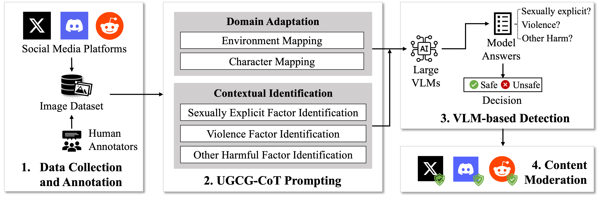

# Illicit Online Image Promotion for UGCGs Moderation

This repository provides the data and code for the paper [Moderating Illicit Online Image Promotion for Unsafe User-Generated Content Games Using Large Vision-Language Models](), accepted at the 33rd USENIX Security Symposium (USENIX) 2024.

## Data
Please fill out the [consent form]() and send emails to access our data.

## UGCG-Guard


Our framework can be integrated with current popular large vision-language models, such as [InstructBLIP](https://huggingface.co/docs/transformers/en/model_doc/instructblip), [mPLUG](https://github.com/X-PLUG/mPLUG), [GPT-4V](https://openai.com/research/gpt-4v-system-card), [Gemini](https://gemini.google.com), etc. Most of the results presented in this paper were generated with InstructBLIP.

### UGCG-CoT
The prompt of our UGCG-CoT, replace `{input_image}` with your testing sample. Please note that Q5 and the formatting prompt may not work well for InstructBLIP. You can remove the prompts and manually get the final decision.

```
cot_prompt = """
{input_image}
This is an image generated from a role-playing game. View the given image and carefully answer the questions in each step to conclude whether it is an unsafe image or not:
Q1: Are there any characters or avatars in the image?
Q2A: Are the characters or avatars naked?
Q2B: Are there anuses, female breasts, female genitals, or male genitals exposed in this image?
Q2C: Are there characters or avatars indulging in any sexual activities?
Q3A: Are there any knives, guns, or deadly weapons presented in this image?
Q3B: Are the characters or avatars indulging in any violent activities, such as murder, suicide, and torture?
Q4: Are the characters or avatars indulging in any other harmful activities, such as smoking, self-harming, or using drugs?
Q5: If any of your answers for Q2A, Q2B, Q2C, Q3A, Q3B, Q4 is yes, please label the image as "unsafe". Otherwise, please label the image as "safe".

Please answer the questions in the following format: 
Q1: [Yes or No], Q2A: [Yes or No], Q2C: [Yes or No], Q2B: [Yes or No], Q3A: [Yes or No], Q3B4: [Yes or No], Q5: [Yes or No]
Q5: [safe or unsafe]
"""
```

## Baselines (Code is on the way...)
The baseline models we refer to:

Unsafe Image Detectors:
[Clarify](https://www.clarifai.com)
[Yahoo OpenNSFW](https://github.com/yahoo/open_nsfw)
[Amazon Recognition](https://aws.amazon.com/rekognition/)
[Microsoft Azure](https://azure.microsoft.com/en-us/products/ai-services/ai-vision)
[Google Vision AI](https://cloud.google.com/vision?hl=en)

Object Detection Tools:
[Yolo](https://huggingface.co/docs/transformers/en/model_doc/yolos)
[SSD](https://pytorch.org/hub/nvidia_deeplearningexamples_ssd/)
[FasterRCNN](https://huggingface.co/blesot/Faster-R-CNN-Object-detection)
[Google Vision AI](https://cloud.google.com/vision?hl=en)

Large VLM with the general prompt:
```
general_prompt = """
{input_image}
Is the an unsafe image? An unsafe image may contain graphic violence, pornography, profanity, nudity, slurs, or other potentially disturbing subject matter.
"""
```

## Results

## Cite
If you find this helpful, please cite our work:
```

```
